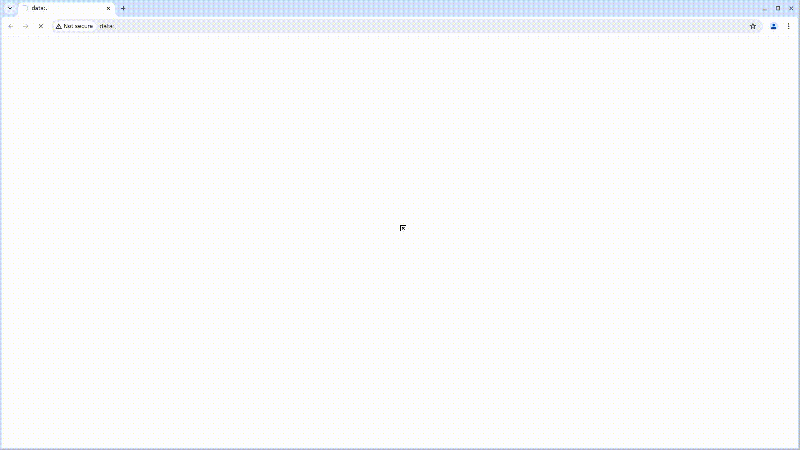

# Покрытие сайта https://centicore.ru тестами предоставляет множество преимуществ для бизнеса и пользователей. Вот основные из них:

 

Сайт — важный инструмент для представления продукции и взаимодействия с клиентами. Для обеспечения его надежности и качества необходимо внедрение тестирования.
Вот несколько причин, почему покрытие тестами критически важно:

1. **Обеспечение стабильности и надежности**: Тесты помогают выявить баги на ранних стадиях разработки или обновления сайта, предотвращая их попадание в продакшн.

2. **Улучшение пользовательского опыта (UX)**: Автоматизированное тестирование производительности помогает выявить узкие места и оптимизировать сайт.

3. **Соответствие законодательным и отраслевым требованиям**: Тесты проверяют корректную работу на разных устройствах, браузерах и операционных системах.

4. **Экономия времени и ресурсов**: Чем раньше найдена ошибка, тем дешевле и быстрее её исправить.


Покрытие сайта тестами — это инвестиция в качество продукта, безопасность пользователей и репутацию компании.

## <a name="Технологии и инструменты">**Технологии и инструменты:**</a>


[](https://www.java.com)[](https://gradle.org)[](https://www.jetbrains.com/idea)[](https://selenide.org)[](https://aerokube.com/selenoid)[](https://junit.org/junit5)[](https://www.jenkins.io)[](https://docs.qameta.io/allure)[](https://telegram.org)

## <a name="Примеры автоматизированных тест-кейсов">**Примеры автоматизированных тест-кейсов:**</a>

- [x] Проверка перехода на страницу О Компании
- [x] Выбор вакансии QA Инженер (Java)
- [x] Переходим на страницу Контакты
- [x] Переходим по кнопке Хабр на сайт Хабр
- [x] Переходим на страницу Высокие технологии


Отчетность о прогоне тестов в Telegram позволит оперативно отслеживать потенциальные и уже существующие проблемы на сайте

### **Пример отчета в Telegram:**

 

### [**Пример Allure отчета:**](https://jenkins.autotests.cloud/job/Centicore-test/15/allure)

 

### *Тест-кейсы*


### [**Параметры сборки в Jenkins:**](https://jenkins.autotests.cloud/job/Centicore-test)

- *ENVIRONMENT (окружение в котором будем запускать тесты, по умолчанию PROD)*
- *COMMENT (комментарий, который отобразиться в Telegram отчете)*
- *BROWSER (браузер, по умолчанию chrome)*
- *HOST (адрес хоста для удалённого запуска тестов)*
- *BROWSER_VERSION (версия браузера, по умолчанию 126)*
- *BROWSER_SIZE (размер окна браузера, по умолчанию 1920x1080)*

<a id="console"></a>
## Команды для запуска из терминала
___
***Локальный запуск:***
```bash  
gradle clean smoke_test
```
```bash  
gradle clean test
```

***Удалённый запуск через Jenkins:***
```bash  
clean 
${TASK} 
--info
"-Dwd=${HOST}" 
"-Dbrowser=${BROWSER}"
"-DbrowserVersion=${BROWSER_VERSION}"
"-DbrowserSize=${BROWSER_SIZE}"
```

***Джоба Jenkins:***

 

***Видео прогона одного из автотестов:***

**Тест: Переходим по кнопке Хабр на сайт Хабр**


